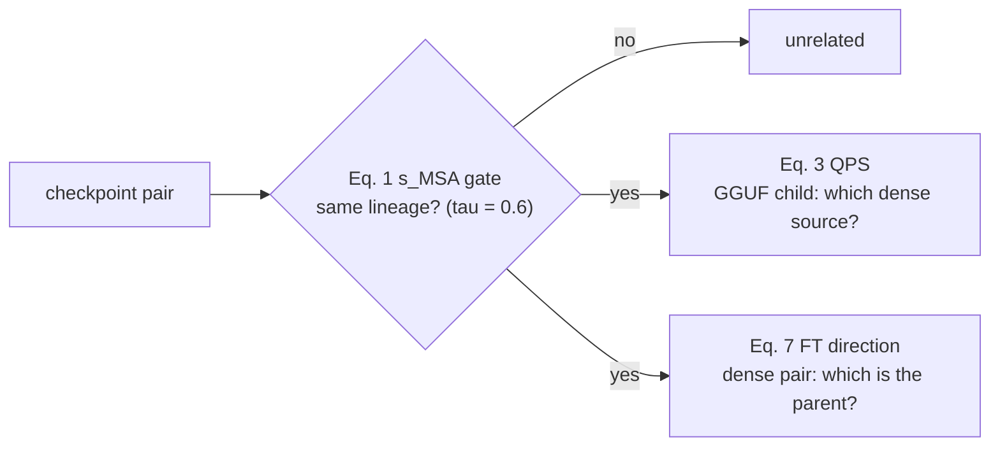

# TensorLock smoke (smokes/tensorlock/)

Passive, weight-level reimplementation of the **pairwise** signals of
**TensorLock** (Wu et al., ISSTA 2026,
[doi:10.1145/3832119](https://doi.org/10.1145/3832119)): the Eq. 1 same-lineage
connectivity gate, the Eq. 3 quantization-provenance score (QPS), and the Eq. 7
fine-tune direction test. Survey deep-dive for
[#26](https://github.com/RedHatResearch/aibom-security/issues/26); runnable-check
context in [../README.md](../README.md).

The authors' artifact (`github.com/TensorLock/TensorLock`) is live but ships **no
license**, so it was used strictly as a read-only behavioral cross-check;
everything below is implemented from the paper equations only.

Corpus-level machinery — HDBSCAN clustering, the MDST provenance tree, edge
merging (IPS/LASSO/TPS, τ_mg=0.9) — is out of scope for this pairwise check, as
is MoE (feeds [#17](https://github.com/RedHatResearch/aibom-security/issues/17)).

```bash
uv sync --all-packages --group smokes
uv run --group smokes python smokes/tensorlock/smoke.py             # all fixtures
uv run --group smokes python smokes/tensorlock/smoke.py --only positive_dense  # one fixture
```

Stdout is a single JSON document (progress goes to stderr). `--cache-dir` and
`--only LABEL` are supported. First cold run downloads the GGUF children
(~0.53 + 0.36 + 1.8 GB) into the shared HF cache; the dense checkpoints are
mostly already cached from the witness-overlap runs.

## Method (pinned from the paper)

Given two checkpoints with dense projection stacks (per-layer q/k/v/o +
gate/up/down; embeddings, lm_head and norms excluded), TensorLock computes:



- **Eq. 1, s_MSA (connectivity gate)**: per MSA role `r ∈ {q,k,v,o}`, per-layer
  std, skew and kurtosis of the flattened weight matrix, truncated to the
  smaller layer count `L_min`; Spearman-correlate each statistic vector across
  the two models, average over the three statistics, then over the four roles.
  Same lineage iff `s_MSA ≥ τ_conn = 0.6` (paper RQ6 optimum).
- **Eq. 3, QPS (quant provenance)**: per layer, an element-aligned 2-D histogram
  (`|B| = 512` equal-width bins over each side's own [min, max] range) of the
  flattened layer weight vectors, scored with arithmetic-normalized mutual
  information `2·I(P;Q)/(H(P)+H(Q))`, averaged over layers. The quantized
  child's source is the argmax over gate-passing parent candidates.
- **Eq. 7, FT direction**: per role `κ ∈ {MSA, FFN}` and layer, the spectral
  entropy `H_σ(W) = −Σ pσ log pσ` over normalized singular values; direction
  `i → j` is a valid parent→child edge iff
  `S = (1/2L) Σ_l Σ_κ [H_σ(W_j) − H_σ(W_i)] > 0` — fine-tuning from a generalist
  parent raises entropy (specialization).
- **Eq. 6, A_dis (context only)**: per-layer `‖W_MSA,i − W_MSA,j‖₂ +
  ‖W_FFN,i − W_FFN,j‖₂` averaged as `(1/2L)Σ`; the paper feeds this to the MDST
  tree, which is out of scope, so it is reported but makes no decision.

Scoring core (`msa_features`, `msa_similarity`, `nmi`, `qps_score`,
`spectral_entropy`, `ft_direction_score`, `ft_distance`) is pure numpy/scipy on
role-keyed tensor dicts — no I/O, no fixtures — so a ProvenanceBench detector
can lift it directly. The NMI was validated against scikit-learn's
`normalized_mutual_info_score(..., average_method="arithmetic")` to 5.6e-16
over 60 randomized cases (throwaway check, not part of the smoke).

GGUF children are read with the `gguf` package and `dequantize()`d; the
dequantized arrays are element-aligned with the source safetensors (verified
against Qwen2.5-0.5B Q8_0: corr ≈ 0.99998 on all seven projections of layer 0).

## Fixtures

All ids verified against the Hub (dense ids reused from the witness-overlap
verification of 2026-10-01; GGUF repos verified 2026-10-04); revisions pinned
in [config.py](config.py) (`REVISIONS`). Everything is ≤1.7B parameters.

| label | pair / fixture | relation | pre-registered expectation |
|---|---|---|---|
| `positive_dense` | HuggingFaceTB/SmolLM2-1.7B → SultanR/SmolTulu-1.7b-Instruct | FT | gate pass, S(parent→child) > 0 → `correct` |
| `vocab_drift` | meta-llama/Llama-3.2-1B → dphn/Dolphin3.0-Llama3.2-1B | FT | gate pass, S(parent→child) > 0 → `correct` |
| `dense_qwen3` | Qwen/Qwen3-0.6B-Base → Qwen/Qwen3-0.6B | FT | gate pass, S(parent→child) > 0 → `correct` |
| `tiny_smoke` | HuggingFaceTB/SmolLM2-135M → SmolLM2-135M-Instruct | FT | gate pass, S(parent→child) > 0 → `correct` |
| `unrelated_cross_family` | HuggingFaceTB/SmolLM2-1.7B ↔ meta-llama/Llama-3.2-1B | unrelated | s_MSA < 0.6 → `correct_rejection` |
| `quant_same_child_q8` | child: QuantFactory/Qwen2.5-0.5B-GGUF `Q8_0`; candidates: Qwen/Qwen2.5-0.5B (true), Qwen2.5-0.5B-Instruct (sibling), HuggingFaceTB/SmolLM2-1.7B (cross-family) | QT | both Qwen candidates pass gate; argmax = true source; QPS(true) near 1, sibling slightly lower |
| `quant_same_child_q4` | same, `Q4_K_M` | QT | argmax still true source; margin may shrink — a flip is a finding, not a failure |
| `quant_unrelated_gguf` | child: bartowski/SmolLM2-1.7B-Instruct-GGUF `Q8_0`; candidates: Qwen/Qwen2.5-0.5B (unrelated), HuggingFaceTB/SmolLM2-1.7B-Instruct (true source) | QT | Qwen fails gate; SmolLM2 passes and wins argmax |

Honest-risk framing, fixed up front: `τ_conn = 0.6` was tuned on the paper's
MDGBench corpus, so a positive pair failing the gate reads as
threshold-sensitivity, not implementation error; and the paper's corpus-level
dependency F1 is 0.78 (0.82 with known clusters), so an individual
`wrong_direction` verdict localizes that error mass rather than refuting the
signal.

**Second pre-registration (2026-10-04, before these fixtures' first run).**
The issue's fixture table also names a Qwen3 cross-family negative
("e.g. Gemma-3-1B") and a tiny negative (`SmolLM2-360M`); a spec review after
the first run flagged them as uncovered. Gemma-3-1B is license-gated in this
environment, so the Qwen3 negative is built from ProvenanceBench-grounded
repos instead (`pb-118`'s card-declared Qwen3 finetune vs the `pb-003`
cross-family control), and `pb-118` itself is added as a community-declared FT
positive — the `base_model` claim shape an AI BOM actually asserts:

| label | pair | relation | pre-registered expectation |
|---|---|---|---|
| `qwen3_sft_community` | Qwen/Qwen3-0.6B → superwhisper/s1-mini (pb-118) | FT | gate pass, S(parent→child) > 0 → `correct` |
| `qwen3_neg_cross` | superwhisper/s1-mini ↔ HuggingFaceTB/SmolLM2-1.7B | unrelated | s_MSA < 0.6 → `correct_rejection` |
| `tiny_scale_negative` | HuggingFaceTB/SmolLM2-135M ↔ SmolLM2-360M | unrelated (same family, different scale) | s_MSA < 0.6 → `correct_rejection`; a pass is a same-family false positive — a finding about τ_conn, not a failure |

## Deviations from the paper

1. **Reimplementation from the paper only**: the artifact has no license; its
   behavior (sklearn `normalized_mutual_info_score` on element-aligned
   binnings, `np.linspace` bin edges, a 500k sample cap, effective-rank FT
   comparison) informed the *readings* below but no code was copied.
2. **QPS joint alignment**: the paper says "the mutual information between the
   weight histograms of the quantized model and each candidate"; the smoke
   reads this as an element-aligned joint contingency table (same stride
   indices on both sides, each binned over its own range), arithmetic
   normalization — exactly what the artifact's sklearn call computes.
3. **Layer weight vector**: "the flattened weight vector of each layer" is
   ambiguous; the smoke concatenates the layer's seven projection matrices
   (the artifact uses a single mid-layer `down_proj` — swept in robustness).
4. **Bin count**: `|B| = 512` from paper RQ6 (the artifact hardcodes 256 —
   swept).
5. **QPS aggregation**: layer-averaged as the paper states (the artifact scores
   one mid layer — swept).
6. **s_MSA layer alignment**: truncate to `L_min` as the paper states (the
   artifact `np.interp`s across layer counts).
7. **H_σ form**: natural-log entropy averaged over the 2L role-layer terms,
   Eq. 7 as written (the artifact compares means of `exp(H)` effective ranks;
   both forms are reported with a sign-agreement flag — swept).
8. **Eq. 6**: computed as context only; the MDST tree that consumes it is out
   of scope.
9. **Sample cap**: per-layer vectors stride-subsampled to 500k elements
   (artifact's `NMI_SAMPLE_POINTS`), identical indices both sides.
10. **Statistic conventions**: population std, biased skew/kurtosis
    (numpy/scipy defaults) — rank-invariant under Spearman for s_MSA.
11. **Candidate pool**: QPS argmax runs over gate-passing candidates only
    (the paper restricts QPS to the connectivity cluster); cross-family
    candidates additionally shape-mismatch, where QPS would abstain anyway.
12. **Not covered**: clustering/MDST/merging (corpus-level), MoE, and the
    paper's full ProvenanceBench-scale evaluation.
13. **Fixture matrix vs the issue sketch** (issue #26's Fixtures table is an
    early sketch; the implemented pairs follow the repo's canonical
    [`fixtures.yaml`](../fixtures.yaml) and ProvenanceBench): the issue's
    "Qwen3-0.6B-Instruct" does not exist on the Hub (Qwen3 ships Base + chat;
    `deferred.dense_qwen3` follows pb-004); the "Dolphin / Llama-3.2-1B false
    claim pair" was never pinned to repos — ProvenanceBench pb-002 ratifies
    Llama-3.2-1B → Dolphin3.0 as a *related* vocab-resize pair (the positive
    here), and false-claim rejection is exercised by the cross-family
    negatives; Gemma-3-1B (the issue's Qwen3-negative example) is license-gated
    in this environment, so `qwen3_neg_cross` substitutes pb-118/pb-003-grounded
    repos.

## Results

First full run on the pinned revisions, 2026-10-04, numpy CPU (arm64 laptop),
τ_conn=0.6, B=512, cap 500k. All 8 first-block pre-registered expectations
held; the second block (below) then held 3/3, for 11/11 overall.

### Dense pairs (Eq. 1 gate + Eq. 7 direction + Eq. 6 context)

| fixture | s_MSA | gate | S(parent→child) | sign agrees exp(H) | A_dis | verdict | time |
|---|---|---|---|---|---|---|---|
| `positive_dense` | 0.9921 | pass | +0.0059 | yes | 117.9 | `correct` | 437 s |
| `vocab_drift` | 0.9961 | pass | +0.0017 | yes | 7.6 | `correct` | 470 s |
| `dense_qwen3` | 0.9929 | pass | +0.0012 | yes | 10.0 | `correct` | 63 s |
| `tiny_smoke` | 0.9971 | pass | +0.0018 | yes | 19.7 | `correct` | 12 s |
| `unrelated_cross_family` | 0.2083 | fail | — | — | — | `correct_rejection` | 16 s |

### Second pre-registration block (post-review additions)

Same settings, run immediately after registration above:

| fixture | s_MSA | gate | S(parent→child) | sign agrees exp(H) | A_dis | verdict | time |
|---|---|---|---|---|---|---|---|
| `qwen3_sft_community` (pb-118) | 0.9972 | pass | +0.00015 | yes | 6.0 | `correct` | 108 s |
| `qwen3_neg_cross` | −0.1036 | fail | — | — | — | `correct_rejection` | 15 s |
| `tiny_scale_negative` | 0.4703 | fail | — | — | — | `correct_rejection` | 22 s |

### Quant fixtures (Eq. 1 gate + Eq. 3 QPS argmax)

| fixture | candidate | s_MSA | gate | QPS | outcome |
|---|---|---|---|---|---|
| `quant_same_child_q8` | Qwen/Qwen2.5-0.5B (true) | 0.9999 | pass | **0.9156** | argmax ✓ |
| | Qwen2.5-0.5B-Instruct (sibling) | 0.9978 | pass | 0.6076 | |
| | HuggingFaceTB/SmolLM2-1.7B | 0.2995 | fail | — (also shape mismatch) | |
| `quant_same_child_q4` | Qwen/Qwen2.5-0.5B (true) | 0.9992 | pass | **0.7119** | argmax ✓ |
| | Qwen2.5-0.5B-Instruct (sibling) | 0.9972 | pass | 0.5757 | |
| | HuggingFaceTB/SmolLM2-1.7B | 0.3001 | fail | — (also shape mismatch) | |
| `quant_unrelated_gguf` | Qwen/Qwen2.5-0.5B | 0.2989 | fail | — (also shape mismatch) | |
| | HuggingFaceTB/SmolLM2-1.7B-Instruct (true) | 0.9999 | pass | **0.7123** | argmax ✓ |

### Reading of the runs

- **Expectations held 11/11** — 8/8 in the first block, 3/3 in the
  post-review second block (two pb-grounded, one issue-table). One wording
  deviation from the first
  pre-registration: the Q8 sibling was registered as "slightly lower" and is in
  fact much lower (0.61 vs 0.92) — a larger margin than expected, in the
  expected direction.
- **The gate is the strong signal, but the band is not empty all the way
  down**: same-lineage pairs score ≥ 0.99 (and stay there through Q8/Q4
  quantization: 0.999), cross-family ≤ 0.30 — and now one observed negative,
  −0.10. τ_conn = 0.6 is nowhere near a boundary at this scale. The one
  fixture between the bands: same-family different-scale (`tiny_scale_negative`)
  at 0.47, the closest negative to the threshold — see the τ_conn bullet below.
- **FT direction is a thin-margin signal**: S ∈ [0.00015, 0.0059] nats — three
  orders of magnitude below the gate separation — but 5/5 fixtures correct,
  and the artifact-style exp(H) (effective-rank) form agrees on the sign in
  every case. The thinnest margin is the community card-declared child
  (pb-118 s1-mini, S = +0.00015): the one fixture shaped like a real AI-BOM
  `base_model` claim is also the one closest to the sign boundary — consistent
  with the paper's corpus dependency F1 of 0.78 (0.82 with known clusters);
  margins this thin will flip occasionally at scale.
- **QPS margins**: true-vs-sibling 0.92/0.61 at Q8_0 (margin 0.31), narrowing
  to 0.71/0.58 at Q4_K_M (margin 0.14) — quantization noise eats the margin
  from above while the sibling's SFT delta stays put; no crossing observed.
- **QPS(true, Q8) is 0.92, not ≈1**: 512 equal-width bins are fine enough
  that Q8_0 round-off alone destroys real mutual information. The argmax is
  unaffected; the absolute value is a bin-resolution artifact, not lineage
  distance.
- **Gate-before-QPS ordering matters**: the cross-family candidate fails the
  gate (0.30) and would additionally shape-mismatch for QPS (hidden 2048 vs
  896) — the paper's cluster-restricted candidate pool makes the QPS shape
  question moot rather than an abstention path.
- **A_dis context**: 117.9 for the heavy-SFT SmolTulu pair vs 6.0–19.7 for the
  rest — raw distance sees the SFT magnitude that the entropy direction
  compresses to a thin positive sign (s1-mini's card-declared FT is the
  smallest: 6.0).
- **`tiny_scale_negative` (0.47) is the gate's most informative negative**:
  same family, same recipe, different scale — its layer-stat profile
  correlates far above the cross-family band (≤ 0.30) but still clears
  τ_conn = 0.6's rejection side with 0.13 to spare. The gate is not measuring
  "same lab" or "same recipe"; at this scale it separates lineage from
  family membership. Note the margin is thin enough that τ_conn = 0.45 would
  flip this verdict — the threshold, not the statistic, carries this case.
- **`qwen3_neg_cross` scored −0.10**: the only negative s_MSA observed — the
  Qwen3 child vs SmolLM2 anti-correlates on layer statistics. Rejection is
  decisive, and the sign itself is a curiosity of Spearman on 28 layer-rows;
  no claim is made beyond the gate verdict.
- **Cost**: ~21 min total on laptop CPU (~19 min first block + ~2.5 min
  second). Dense pairs are SVD-bound (2L·7
  matrices per pair, up to 8 min for the 1.7B pairs); quant fixtures are
  NMI-only (17–72 s). The paper's four A100 80GB GPUs are a corpus-scale
  (137 models) statement, not a pairwise one.

## Robustness of the judgment calls

Throwaway driver on the cached weights (`/tmp/tl_sweep.py`), 2026-10-04.
**Zero verdict flips in any sweep cell.**

**Gate threshold τ_conn ∈ {0.5, 0.6, 0.7}**: the observed separation is
cross-family ≤ 0.30 (and one −0.10) → same-family-different-scale 0.47 →
same-lineage ≥ 0.99 — every same-lineage pair (dense and quantized) passes at
all three thresholds, every negative fails at all three. At fixture scale the
gate is threshold-insensitive; the one case the threshold *carries* is
`tiny_scale_negative` (0.47 fails at 0.5 by 0.03 — a τ_conn of 0.45 would flip
it), which is why the second pre-registration marks a pass there as a finding
rather than a failure. τ_conn otherwise only matters on the paper's corpus.

**QPS bin count B ∈ {128, 256, 512, 1024}** (pinned concat aggregation):

| fixture | true @ B128/256/512/1024 | sibling @ B128/256/512/1024 | margin trend |
|---|---|---|---|
| `quant_same_child_q8` | 0.953 / 0.937 / 0.916 / 0.894 | 0.732 / 0.684 / 0.608 / 0.533 | grows 0.22 → 0.36 |
| `quant_same_child_q4` | 0.813 / 0.772 / 0.712 / 0.638 | 0.711 / 0.654 / 0.576 / 0.504 | peaks at B512 (0.14) |

The true source wins at every B. Finer bins separate true-vs-sibling *better*
at Q8 (quantization round-off and SFT deltas differ in fine structure), while
Q4_K_M margins peak around the paper's B=512 — the RQ6 choice is also the
fixture-optimal one here. The Q4 margin at B=128 (0.10) is the thinnest cell
in the sweep; it never crosses.

**QPS aggregation** (B=512 unless noted): per-matrix mean stays within 0.01 of
the pinned layer-concat (q8 true 0.908 vs 0.916; q4 true 0.702 vs 0.712) —
the layer-vector reading is not load-bearing. The artifact's convention
(single mid-layer `down_proj`, B=256) also picks the true source in every
fixture (q8 0.945 vs sibling 0.670; q4 0.687 vs 0.603), though single-layer
scores are visibly higher-variance (it rates the unrelated fixture's true
source 0.928 vs 0.712 concat) — a wider absolute range, not a different
decision.

**H_σ vs exp(H)**: the effective-rank form agrees with the Eq. 7 sign on all
five dense FT pairs (recorded per pair in the JSON output, no re-sweep needed).

## Output contract

One JSON object on stdout per run: `params` (τ_conn, bins, cap); per dense pair
`{label, parent/child repo+revision, relation, s_MSA {score, per_role}, gate,
ft_direction {S_parent_to_child, parent_to_child_valid, S_child_to_parent,
sign_agrees_effective_rank_form, per_role}, ft_distance, verdict,
compute_seconds}`; per quant fixture `{label, child repo+file+quant+revision,
true_source, candidates [{repo_id, revision, s_msa, gate, qps {qps,
per_layer_min/max} | reason}], qps_argmax, verdict, compute_seconds}`.
Verdict vocabulary: dense `correct` / `wrong_direction` / `correct_rejection` /
`gate_miss` / `gate_pass_on_unrelated`; quant `correct` / `wrong_parent` /
`no_candidate`.
